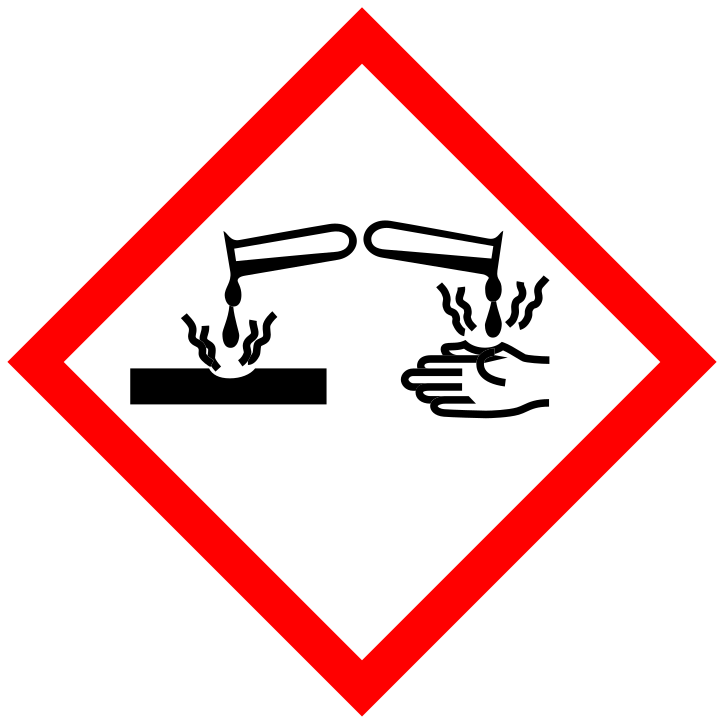

<!--

author:  Dr. Marcus Herbig
email:   marcus.herbig@chemie.tu-freiberg.de

version: 0.1

comment: This is a plugin for including chemical fomulas into LiaScript. The syntax is similar to the LaTeX package chemmacros.

link:      style_chemmacros.css

script:    chemmacros.js

@ch

@end

@reaction

@end

@reactions

@end

@ghspic
 
@end

@signalword: 
@0

@statementsLangType

@end

@hstatements
  @statementsLangType(en, H, @'0)
@end

@pstatements
  @statementsLangType(en, P, @'0)
@end
-->

# ChemmacrosJS
This project aims to make the functions of the excellent LaTeX package *chemmacros* available for JavaScript and use in HTML. Integration in LiaScript (https://liascript.github.io/) is just as possible as use with vanilla JavaScript.

## Use in Vanilla JavaScript

## License
This project is published to the terms of the [CC-BY Attribution 4.0 International Deed](https://creativecommons.org/licenses/by/4.0/).
